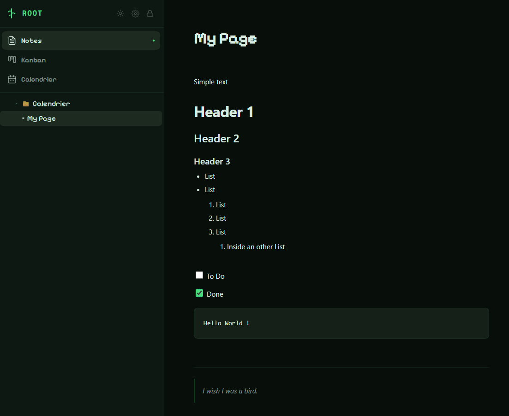
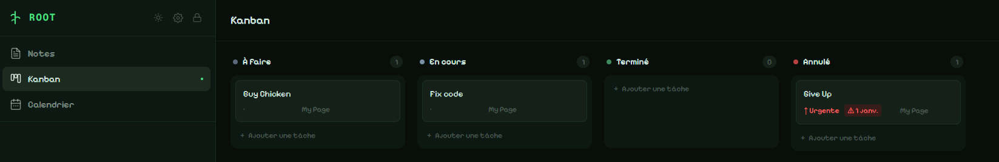
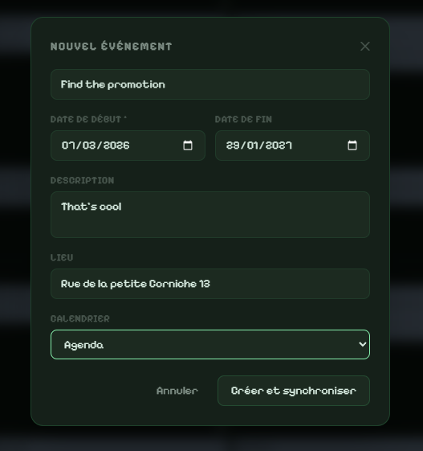
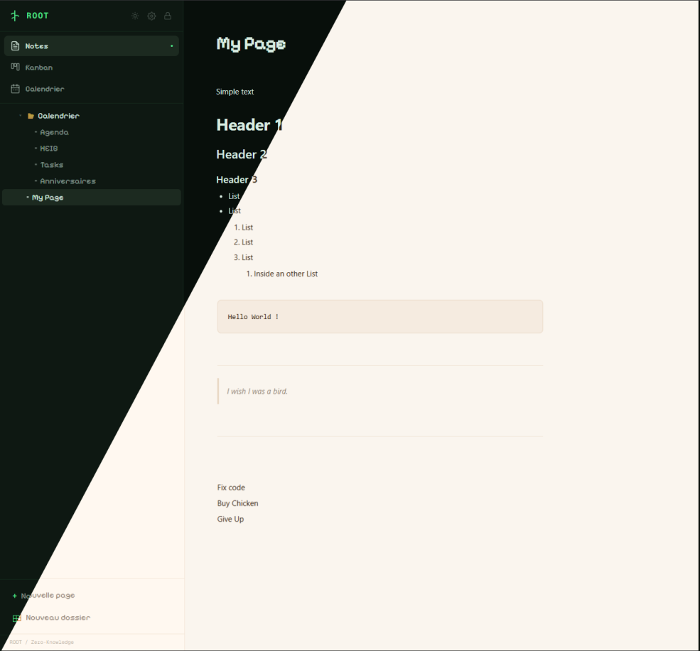

<br/>

<p align="center">
  
</p>

<h1 align="center">ROOT</h1>

<p align="center">
  Zero-Knowledge personal workspace.<br/>
  Notes, Kanban, Calendar — fully local, fully encrypted, zero server.
</p>

<p align="center">
  
  
  
  
  
  
</p>

---

## What it is

ROOT is a single-user, offline-first workspace that lives entirely in your browser's IndexedDB. There is no account, no API, no telemetry. Your Master Password never leaves your device — it derives a `CryptoKey` that is `extractable: false` and used exclusively in-RAM. Everything written to disk (IndexedDB) is an AES-GCM ciphertext.

---

## Features

<table>
<tr>

<h3>

Notes
</h3>

Rich block editor powered by TipTap. Paragraphs, headings (H1–H3), lists, task lists, code blocks, quotes, tables, images, dividers. Every block is encrypted individually — the storage engine never sees plaintext.

Pages live in a tree. Folders group them. Drag-and-drop reorders anything, including moving items back to root. The editor occupies 90% of the viewport, centered and dynamically adjusted when the sidebar opens or closes.

A floating toolbar appears on hover at the bottom of the editor — undo/redo, formatting shortcuts, contextual table actions. Right-clicking anywhere in the editor opens a slash-command menu (same options as `/`) with table actions appended when the cursor is inside a table.



</tr>
<tr>

<h3>

Kanban
</h3>

Persistent task board with status columns. Cards carry priority, due date, and tags. Tasks are stored as encrypted blocks, indistinguishable from any other content in the database.



</tr>
<tr>

<h3>

Calendar + CalDAV
</h3>

FullCalendar view with two-way sync to any CalDAV server (Infomaniak, Fastmail, iCloud, Nextcloud…). Credentials are encrypted at rest. Sync runs through a local nginx reverse proxy that handles CORS — no data transits a third-party.

Each calendar can be mapped to either the calendar view or the Kanban board. Category visibility can be toggled live directly from the calendar header. Events support start and end times — all-day or timed, with full CalDAV iCal compatibility. From a category detail view, clicking any event opens the shared edit modal; categories can be cleared (with CalDAV warning) or deleted locally.



</tr>
<tr>

<h3>

Zero-Knowledge vault
</h3>

Unlock with a Master Password. PBKDF2 (SHA-256, 600 000 iterations) derives the key. A sentinel value proves the password is correct without storing it. The `CryptoKey` is `extractable: false` — the browser will never hand it back to JavaScript.

Lock at any time. The key is erased from memory. The app returns to the password screen with a time-of-day greeting.

New users go through an onboarding checklist explaining the constraints (no recovery, local-only, backup responsibility). It can be re-read at any time from Settings → Profile.



</tr>
</table>

---

## Security model

| Layer | Mechanism |
|---|---|
| Key derivation | PBKDF2-SHA256, 600 000 iterations, 256-bit random salt |
| Encryption | AES-GCM 256-bit, unique 96-bit IV per ciphertext |
| Key storage | `CryptoKey { extractable: false }` — in RAM only, never persisted |
| Password verification | Encrypted sentinel constant, compared after decryption |
| Plaintext surface | Zero — titles, content, settings, credentials all encrypted before IndexedDB write |
| Network | Static export only. CalDAV sync via local nginx proxy (no external relay) |

---

## Data management

| Action | What it does |
|---|---|
| **Backup** | Exports selected data (Pages & blocks / Settings) as a portable `.json`. Requires Master Password confirmation. |
| **Restore** | Imports a backup. Choose **Overwrite** (replaces selected tables) or **Merge** (upserts by primary key, keeps existing data). Requires Master Password confirmation. |
| **Export MD** | Decrypts and exports all pages as `.md` files (ZIP, single file, multiple files, or folder). |
| **Import MD** | Creates a new encrypted page from a `.md` file. |
| **Nuke** | Deletes the entire IndexedDB database and localStorage. Type `NUKE` to confirm. |

---

## Stack

| | |
|---|---|
| Framework | Next.js 15 (static export — no server runtime) |
| Editor | TipTap 3 |
| Storage | Dexie.js (IndexedDB) |
| Crypto | Web Crypto API (native browser) |
| State | Zustand |
| Calendar | FullCalendar 6 |
| Drag & drop | dnd-kit |
| Serving | nginx (static files + CalDAV reverse proxy) |
| Container | Docker (multi-stage: node:20-alpine → nginx:1.27-alpine) |

---

## Run with Docker

```bash
docker run -p 8443:80 ghcr.io/Dansnts/root:latest
```

Then open `https://localhost:8443`. On first launch, create your vault with a Master Password. Nothing else is required.

> **TLS is mandatory.** The Web Crypto API (`SubtleCrypto`) is only available in [Secure Contexts](https://developer.mozilla.org/en-US/docs/Web/Security/Secure_Contexts) — HTTPS or `localhost`. Without TLS the vault will refuse to unlock.

### Certificates

Place your certificate files in the `certs/` folder before building or mounting:

```
certs/
  cert.pem   ← TLS certificate (or self-signed)
  key.pem    ← private key
```

For local development you can generate a self-signed certificate:

```bash
mkdir certs
openssl req -x509 -newkey rsa:4096 -keyout certs/key.pem -out certs/cert.pem \
  -days 365 -nodes -subj "/CN=localhost"
```

For production, drop in your real certificate (Let's Encrypt, etc.) and rebuild.

### Build from source

```bash
git clone <this-repo>
cd ROOT/ROOT
# Generate or copy your certs first (see above)
docker build -t root .
docker run -p 8443:443 root
```

---

## Architecture

```
browser
  └── Next.js SPA (static)
        ├── VaultGate       password screen, key derivation, onboarding
        ├── AppShell        layout, routing between views
        │     ├── Sidebar   page tree, drag-and-drop, navigation
        │     ├── Notes     TipTap block editor + floating hub + context menu
        │     ├── Kanban    task board
        │     └── Calendar  FullCalendar + CalDAV sync + category filters
        └── IndexedDB (Dexie)
              ├── vault_meta   salt + encrypted sentinel
              ├── pages        encrypted titles, tree structure
              ├── blocks       encrypted content, one row per block
              └── settings     encrypted CalDAV config, preferences, tags

nginx (container)
  ├── /            → static Next.js build
  └── /caldav-proxy/<host><path>  → reverse proxy to CalDAV server
```

All reads and writes go through `VaultService` (encrypt/decrypt) before touching IndexedDB. There is no code path that stores plaintext.

---

## Changelog

| Version | Date | Changes |
|---|---|---|
| **v1.3.0** | 2026-03-14 | Full UI redesign — bioluminescent terminal aesthetic (animations, halos, breathing glows, styled empty states across all views). Calendar: start/end time support (all-day toggle, HH:MM pickers, DTSTART datetime in iCal, timeGrid display). Category view: click event opens shared EventModal; "Vider la catégorie" with CalDAV warning; "Supprimer la catégorie" (local only). Nav fix: clicking Calendar from a category always returns to calendar. |
| **v1.2.4** | 2026-03-13 | Editor at 90% width, dynamically centered (ResizeObserver). Floating hub appears on hover with pop animation. Right-click context menu with slash-command options + table actions. Native browser context menu suppressed app-wide. Backup export/import: choose content (Pages / Settings) and import mode (Overwrite or Merge). |
| **v1.2.3** | 2026-03-11 | Calendar category visibility toggles. Custom "+X more" popover. Sidebar DnD: drop to root zone. |
| **v1.2.2** | 2026-03-11 | Replaced image logo with text wordmark. Removed Changelog tab from Settings. |
| **v1.2.1** | 2026-03-10 | Stats view (radar chart, weekly recap, priority counters). User avatar with interactive crop. Master Password confirmation before backup download. Drawer close animation fix. Date picker overflow fix. |
| **v1.1.0** | 2026-03-09 | Avatar sidebar button with dropdown (theme, settings, lock). Integrated changelog panel. Day view in Calendar. Onboarding modal for new users with constraint checklist. Password confirmation for export/import backup. |
| **v1.0.0** | 2026-03-08 | Major refactor. CalDAV bug fix. TablePicker 6×6. Image paste/drop. `/bold` and `/italic` slash commands. |
| **v0.9.0** | 2026-03-07 | Trash with restore. Tag system. Standalone calendar + CalDAV sync. MD export. Portable JSON backup. Bubble toolbar. Table picker. Images. |
| **v0.8.0** | 2026-03-07 | TipTap block editor. Kanban with 4 columns. Card drag & drop. Task detail (priority, tags, due date). |
| **v0.7.0** | 2026-03-07 | Zero-Knowledge vault (AES-256-GCM + PBKDF2 600k). Hierarchical page tree. Page drag & drop. Light/dark theme. |

---

## License

[CC BY-NC-SA 4.0](https://creativecommons.org/licenses/by-nc-sa/4.0/) — free to use, share, and adapt with attribution, non-commercially, under the same license.

<p align="center">
  <sub>Zero-Knowledge · AES-GCM 256 · PBKDF2 600k · local-first</sub>
</p>
